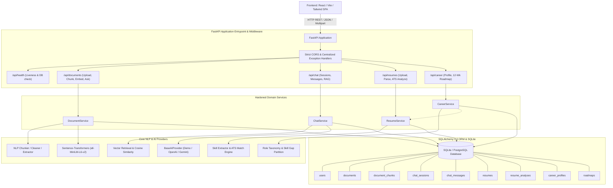

# SahayakAI — System Architecture Specification

**Status:** ACTIVE  
**Version:** 1.4.0  
**Current Phase:** Completed STEP 14 (Security Hardening, E2E Verification & Production Readiness)  
**Verification Baseline:** 236 / 236 Tests Passing (100% Green) | Full Synthetic Journey Verified

---

## 1. System Overview

SahayakAI is an AI-powered academic and career mentorship assistant designed to deliver offline-capable document analysis, contextual study assistance, automated ATS resume evaluation, and personalized career roadmaps.

The platform is designed following strict layered architecture principles:
1. **Presentation Layer**: React Single Page Application (Vite + Tailwind CSS) [Target: STEP 12].
2. **API & Orchestration Layer**: FastAPI REST framework with centralized error handling, request validation, CORS protection, and routers:
   - `/api/health` (Liveness, database connectivity, active AI provider mode)
   - `/api/documents` (Upload, inspection, chunks, embedding, RAG ask)
   - `/api/chat` (Sessions, message history, document-grounded multi-turn conversational chat)
   - `/api/resumes` (Upload, structured parsing, ATS comparison scorecard)
   - `/api/career` (Career profile management, 12-week personalized milestone roadmaps)
3. **Domain & Business Logic Layer**:
   - Ingestion & Extraction Services (`backend/app/services/document_service.py` via PyMuPDF and UTF-8 multi-encoding decoding).
   - Core NLP Engine (`backend/app/nlp/` — deterministic text cleaner, reading statistics, script-based language identification, multilingual keyword extraction, query preprocessor, boundary-aware sliding window chunker).
   - Embedding & Transformer Engine (`backend/app/rag/` — `all-MiniLM-L6-v2` 384-dimensional sentence-transformers, L2 normalization, in-process model caching, batch encoding, JSON vector persistence).
   - Local RAG Retrieval Engine (NumPy dot product, cosine similarity search, threshold gating).
   - Study Assistant & Grounded Chat Service (multi-turn dialogue, bounded history, citation tracking).
   - Resume ATS Skill Gap Analyzer (structured parsing, taxonomy normalization, transparent scoring).
   - Dynamic Career Roadmap Synthesizer (deterministic taxonomy, skill gaps, milestone planning).
4. **AI Provider Abstraction Layer**: Generic `BaseAIProvider` decoupling domain logic from concrete LLMs (`DemoProvider`, `OpenAICompatibleProvider`, `GeminiProvider`).
5. **Persistence Layer**: SQLAlchemy 2.0 ORM with SQLite default storage (`data/sahayakai.db`) and strict referential integrity (`PRAGMA foreign_keys=ON`).

---

## 2. Integrated Architecture Graph

---

## 3. Security & User-Scoping Architecture

All domain models strictly enforce ownership boundaries through the `X-User-Id` request header:
- When supplied, access to another user's Document, ChatSession, Resume, CareerProfile, or Roadmap is blocked with `HTTP 403 Forbidden` (`*_ACCESS_DENIED`).
- Deletions are atomic and cascade to child records (Document -> Chunks, ChatSession -> Messages, Resume -> Analyses, CareerProfile -> Roadmaps) while unlinking stored disk files.
- Secrets (`OPENAI_API_KEY`, `GEMINI_API_KEY`) and internal stack traces are strictly stripped from all public error responses and OpenAPI schemas.

---

## 4. Cross-Module Workflows

### Workflow A: Reference Document Study & Conversational RAG
1. User uploads study guide -> `process_document_upload` chunks and persists text.
2. `embed_document_chunks` generates L2-normalized 384-dimensional embeddings.
3. User creates a `ChatSession` referencing `document_id`.
4. User submits question -> `send_message` retrieves top-K chunks via cosine similarity, checks relevance threshold (0.35), synthesizes response via AI provider, and cites source chunks with similarity scores.
5. Out-of-context questions return safe, non-hallucinated insufficient evidence fallbacks.

### Workflow B: Resume Analysis & ATS Scorecard
1. Candidate uploads resume (PDF/TXT) -> parsed for skills, education, experience.
2. Candidate submits target job description -> ATS score computed deterministically:
   $$\text{match\_score} = \left( \frac{|\text{Matched Required Skills}|}{|\text{Total Required Skills in Job Description}|} \right) \times 100$$
3. Recommendations generated based on missing competencies and missing resume sections.

### Workflow C: Career Profile & Personalized Roadmap
1. Candidate maintains target role and skill inventory in `CareerProfile`.
2. Candidate triggers roadmap generation, optionally referencing an uploaded resume.
3. Engine performs deterministic skill gap analysis against curated `ROLE_TAXONOMY` (10 technical disciplines), builds a 12-week structured progression plan, assigns hands-on projects, and suggests core technical interview topics.
4. AI Provider adds contextual natural-language pedagogical advice.

---

## 5. Subsystem Documentation
- [Frontend Contract](frontend_contract.md)
- [Architecture Decisions (ADRs)](decisions.md)
- [API Reference](api.md)
- [Career Roadmap Specification](career_roadmap.md)
- [Resume Analyzer Specification](resume_analyzer.md)
- [Chat & Study Assistant Specification](chat_study_assistant.md)
\n---

## 6. Step 14 Security Hardening & Production Verification

In Step 14, the entire application was hardened and verified across 23 comprehensive security and production readiness gates:

1. **Multi-Tenant Cross-User Isolation**: All domain entities (`Document`, `ChatSession`, `Resume`, `CareerProfile`, `Roadmap`) are protected by ownership verification against `X-User-Id`. Cross-user access or deletion attempts strictly return `HTTP 403 Forbidden` (`DOCUMENT_ACCESS_DENIED`, etc.).
2. **Prompt Injection Containment**: Hostile system prompt overrides and key leakage queries are trapped by cosine similarity thresholds (`SIMILARITY_THRESHOLD = 0.35`) and strict context gating, returning controlled fallback notices without leaking system secrets.
3. **Safe File Upload & Path Traversal Prevention**: Uploads are restricted to `.pdf` and `.txt`, validated for size bounds, sanitized against path traversal (`..`, `/`), and stored under UUID-prefixed filenames.
4. **Cascading Referential Integrity**: Cascade deletions reliably clean up dependent child records (chunks, messages, analyses, roadmaps) and unlink disk files, verified with `PRAGMA integrity_check;`.
5. **Zero Key Exposure**: Sensitive API credentials and system tracebacks are strictly excluded from responses, logs, and public OpenAPI schemas.\n