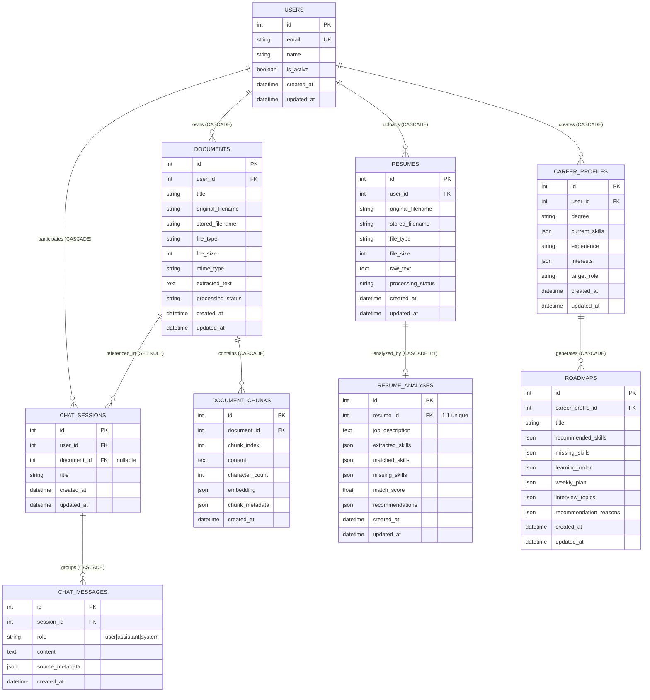

# SahayakAI — Database Architecture Specification

**Status:** APPROVED  
**Version:** 1.0.0  
**Last Updated:** 2026-09-22  
**Implementation Phase:** STEP 3 (Database Models & Schemas)

---

## 1. Overview & Architecture

SahayakAI utilizes **SQLAlchemy 2.0 ORM** with **SQLite** (`data/sahayak.db`) as its default local database engine. The data model is designed to support:
1. **User Identity & Multi-tenancy**: Core `User` model providing top-level ownership for all application artifacts.
2. **Knowledge Base & Document Management**: `Document` and `DocumentChunk` models supporting uploaded PDF/TXT files and chunked text segments with embedded vector representations.
3. **Conversational AI & History**: `ChatSession` and `ChatMessage` models providing contextual conversational turns with citation metadata.
4. **Resume Analyzer**: `Resume` and `ResumeAnalysis` models supporting file storage metadata, extracted skills, matched skills, missing skills, and numeric match scores.
5. **Career Guidance & Roadmaps**: `CareerProfile` and `Roadmap` models storing user aspirations, existing proficiencies, milestone timelines, weekly study plans, and interview preparation topics.

The database initialization is fully automated and idempotent via `init_db()` in `backend/app/database.py`, registered directly into the FastAPI application lifespan.

---

## 2. Entity Relationship Diagram (ERD)



---

## 3. Table Specifications

### 3.1 `users`
Represents registered students, job seekers, and system evaluators.

| Column | Type | Nullable | Constraints & Defaults | Description |
|---|---|---|---|---|
| `id` | `INTEGER` | No | Primary Key, Autoincrement, Indexed | Unique user identifier |
| `email` | `VARCHAR(255)` | No | Unique, Indexed | Contact/login email |
| `name` | `VARCHAR(100)` | No | — | Display or legal name |
| `is_active` | `BOOLEAN` | No | Default: `True` | Account status flag |
| `created_at` | `DATETIME (UTC)` | No | Default: `utcnow()` | Record creation timestamp |
| `updated_at` | `DATETIME (UTC)` | No | Default: `utcnow()`, onupdate | Record update timestamp |

* **Relationships:**
  * `documents`: One-to-Many (`Document`), `cascade="all, delete-orphan"`
  * `chat_sessions`: One-to-Many (`ChatSession`), `cascade="all, delete-orphan"`
  * `resumes`: One-to-Many (`Resume`), `cascade="all, delete-orphan"`
  * `career_profiles`: One-to-Many (`CareerProfile`), `cascade="all, delete-orphan"`

---

### 3.2 `documents`
Uploaded reference documents, course curricula, or user knowledge assets.

| Column | Type | Nullable | Constraints & Defaults | Description |
|---|---|---|---|---|
| `id` | `INTEGER` | No | Primary Key, Autoincrement, Indexed | Document identifier |
| `user_id` | `INTEGER` | No | Foreign Key (`users.id`, `ON DELETE CASCADE`), Indexed | Owning user |
| `title` | `VARCHAR(255)` | Yes | — | Optional user-defined title |
| `original_filename` | `VARCHAR(255)` | No | — | Original client filename |
| `stored_filename` | `VARCHAR(255)` | No | — | Server disk filename (UUID-based) |
| `file_type` | `VARCHAR(50)` | No | — | Extension/format (`pdf`, `txt`, etc.) |
| `file_size` | `INTEGER` | No | — | File size in bytes |
| `mime_type` | `VARCHAR(100)` | Yes | — | MIME content type |
| `extracted_text` | `TEXT` | Yes | — | Full normalized parsed text |
| `processing_status` | `VARCHAR(50)` | No | Default: `'pending'` | Processing state (`pending`, `processed`, `failed`) |
| `created_at` | `DATETIME (UTC)` | No | Default: `utcnow()` | Creation timestamp |
| `updated_at` | `DATETIME (UTC)` | No | Default: `utcnow()`, onupdate | Update timestamp |

* **Relationships:**
  * `user`: Many-to-One (`User`), back-populates `documents`
  * `chunks`: One-to-Many (`DocumentChunk`), `cascade="all, delete-orphan"`, ordered by `chunk_index`
  * `chat_sessions`: One-to-Many (`ChatSession`), `foreign_keys="ChatSession.document_id"`

---

### 3.3 `document_chunks`
Vectorized text segments used by RAG for similarity search and contextual generation.

| Column | Type | Nullable | Constraints & Defaults | Description |
|---|---|---|---|---|
| `id` | `INTEGER` | No | Primary Key, Autoincrement, Indexed | Chunk identifier |
| `document_id` | `INTEGER` | No | Foreign Key (`documents.id`, `ON DELETE CASCADE`), Indexed | Parent document |
| `chunk_index` | `INTEGER` | No | — | Zero-based sequence index within document |
| `content` | `TEXT` | No | — | Chunk text snippet |
| `character_count` | `INTEGER` | No | — | Length of chunk content |
| `embedding` | `JSON` | Yes | — | Float list: `[0.012, -0.045, ...]` (384-dim) |
| `chunk_metadata` | `JSON` | Yes | — | Arbitrary chunk metadata (page, headings) |
| `created_at` | `DATETIME (UTC)` | No | Default: `utcnow()` | Creation timestamp |

* **Relationships:**
  * `document`: Many-to-One (`Document`), back-populates `chunks`

---

### 3.4 `chat_sessions`
Contextual conversational threads grouping multi-turn chat interactions.

| Column | Type | Nullable | Constraints & Defaults | Description |
|---|---|---|---|---|
| `id` | `INTEGER` | No | Primary Key, Autoincrement, Indexed | Session identifier |
| `user_id` | `INTEGER` | No | Foreign Key (`users.id`, `ON DELETE CASCADE`), Indexed | Owning user |
| `document_id` | `INTEGER` | Yes | Foreign Key (`documents.id`, `ON DELETE SET NULL`), Indexed | Optional scoped reference document |
| `title` | `VARCHAR(255)` | No | Default: `'New Chat'` | Session display title |
| `created_at` | `DATETIME (UTC)` | No | Default: `utcnow()` | Creation timestamp |
| `updated_at` | `DATETIME (UTC)` | No | Default: `utcnow()`, onupdate | Update timestamp |

* **Relationships:**
  * `user`: Many-to-One (`User`), back-populates `chat_sessions`
  * `document`: Many-to-One (`Document`), back-populates `chat_sessions`
  * `messages`: One-to-Many (`ChatMessage`), `cascade="all, delete-orphan"`, ordered by `id`

---

### 3.5 `chat_messages`
Individual conversational turns with citations and role attribution.

| Column | Type | Nullable | Constraints & Defaults | Description |
|---|---|---|---|---|
| `id` | `INTEGER` | No | Primary Key, Autoincrement, Indexed | Message identifier |
| `session_id` | `INTEGER` | No | Foreign Key (`chat_sessions.id`, `ON DELETE CASCADE`), Indexed | Owning chat session |
| `role` | `VARCHAR(50)` | No | `CheckConstraint("role IN ('user', 'assistant', 'system')")` | Sender role |
| `content` | `TEXT` | No | — | Message textual body |
| `source_metadata` | `JSON` | Yes | — | RAG citations, document references, confidence |
| `created_at` | `DATETIME (UTC)` | No | Default: `utcnow()` | Message post timestamp |

* **Relationships:**
  * `session`: Many-to-One (`ChatSession`), back-populates `messages`

---

### 3.6 `resumes`
Uploaded applicant resumes for ATS matching and skill gap evaluation.

| Column | Type | Nullable | Constraints & Defaults | Description |
|---|---|---|---|---|
| `id` | `INTEGER` | No | Primary Key, Autoincrement, Indexed | Resume identifier |
| `user_id` | `INTEGER` | No | Foreign Key (`users.id`, `ON DELETE CASCADE`), Indexed | Owning user |
| `original_filename` | `VARCHAR(255)` | No | — | Original client filename |
| `stored_filename` | `VARCHAR(255)` | No | — | Stored disk filename (UUID-based) |
| `file_type` | `VARCHAR(50)` | No | — | File format (`pdf`, `docx`, `txt`) |
| `file_size` | `INTEGER` | No | — | Size in bytes |
| `raw_text` | `TEXT` | Yes | — | Parsed raw resume text |
| `processing_status` | `VARCHAR(50)` | No | Default: `'uploaded'` | Status (`uploaded`, `analyzed`, `failed`) |
| `created_at` | `DATETIME (UTC)` | No | Default: `utcnow()` | Upload timestamp |
| `updated_at` | `DATETIME (UTC)` | No | Default: `utcnow()`, onupdate | Update timestamp |

* **Relationships:**
  * `user`: Many-to-One (`User`), back-populates `resumes`
  * `analysis`: One-to-One (`ResumeAnalysis`), `uselist=False`, `cascade="all, delete-orphan"`

---

### 3.7 `resume_analyses`
Structured output from the ATS analyzer and LLM skill matching engine.

| Column | Type | Nullable | Constraints & Defaults | Description |
|---|---|---|---|---|
| `id` | `INTEGER` | No | Primary Key, Autoincrement, Indexed | Analysis identifier |
| `resume_id` | `INTEGER` | No | Foreign Key (`resumes.id`, `ON DELETE CASCADE`), Unique, Indexed | Target resume (1:1) |
| `job_description` | `TEXT` | Yes | — | Target job description text |
| `extracted_skills` | `JSON` | Yes | — | List of identified resume skills |
| `matched_skills` | `JSON` | Yes | — | List of matched target skills |
| `missing_skills` | `JSON` | Yes | — | List of skill gaps |
| `match_score` | `FLOAT` | Yes | — | Calculated ATS match percentage (0.0 - 100.0) |
| `recommendations` | `JSON` | Yes | — | Actionable improvement suggestions |
| `created_at` | `DATETIME (UTC)` | No | Default: `utcnow()` | Creation timestamp |
| `updated_at` | `DATETIME (UTC)` | No | Default: `utcnow()`, onupdate | Update timestamp |

* **Relationships:**
  * `resume`: One-to-One (`Resume`), back-populates `analysis`

---

### 3.8 `career_profiles`
Academic background, existing skills, and target career goals.

| Column | Type | Nullable | Constraints & Defaults | Description |
|---|---|---|---|---|
| `id` | `INTEGER` | No | Primary Key, Autoincrement, Indexed | Career profile identifier |
| `user_id` | `INTEGER` | No | Foreign Key (`users.id`, `ON DELETE CASCADE`), Indexed | Owning user |
| `degree` | `VARCHAR(255)` | Yes | — | Educational background |
| `current_skills` | `JSON` | Yes | — | Existing skills (list or structured dict) |
| `experience` | `VARCHAR(255)` | Yes | — | Experience level description |
| `interests` | `JSON` | Yes | — | List of career domains / interests |
| `target_role` | `VARCHAR(255)` | No | — | Intended career position |
| `created_at` | `DATETIME (UTC)` | No | Default: `utcnow()` | Creation timestamp |
| `updated_at` | `DATETIME (UTC)` | No | Default: `utcnow()`, onupdate | Update timestamp |

* **Relationships:**
  * `user`: Many-to-One (`User`), back-populates `career_profiles`
  * `roadmaps`: One-to-Many (`Roadmap`), `cascade="all, delete-orphan"`

---

### 3.9 `roadmaps`
Personalized, step-by-step career path with weekly milestones and interview preparation.

| Column | Type | Nullable | Constraints & Defaults | Description |
|---|---|---|---|---|
| `id` | `INTEGER` | No | Primary Key, Autoincrement, Indexed | Roadmap identifier |
| `career_profile_id` | `INTEGER` | No | Foreign Key (`career_profiles.id`, `ON DELETE CASCADE`), Indexed | Parent career profile |
| `title` | `VARCHAR(255)` | No | — | Roadmap title |
| `recommended_skills` | `JSON` | Yes | — | Target skills to acquire |
| `missing_skills` | `JSON` | Yes | — | Identified skill deficits |
| `learning_order` | `JSON` | Yes | — | Ordered milestone / phase sequence |
| `weekly_plan` | `JSON` | Yes | — | Structured weekly study modules |
| `interview_topics` | `JSON` | Yes | — | High-frequency interview prep topics |
| `recommendation_reasons` | `JSON` | Yes | — | Rationale explaining recommendations |
| `created_at` | `DATETIME (UTC)` | No | Default: `utcnow()` | Creation timestamp |
| `updated_at` | `DATETIME (UTC)` | No | Default: `utcnow()`, onupdate | Update timestamp |

* **Relationships:**
  * `career_profile`: Many-to-One (`CareerProfile`), back-populates `roadmaps`

---

## 4. Timestamp & Timezone Strategy

SQLite does not have a native timezone-aware `DATETIME` storage type; standard `DateTime(timezone=True)` columns often deserialize as timezone-naive `datetime` objects under the `pysqlite` driver.

To guarantee rigorous cross-platform UTC timestamps, SahayakAI implements:
1. **`UTCDateTime(TypeDecorator)`** (`backend/app/models/base.py`):
   - **`process_bind_param`**: Converts incoming datetimes to UTC; naive datetimes are assumed UTC.
   - **`process_result_value`**: Always attaches `timezone.utc` to returned datetime instances.
2. **`TimestampMixin`**:
   - Standardizes `created_at` and `updated_at` columns across entities.
   - Defaults to `utc_now` (`lambda: datetime.now(timezone.utc)`).
   - `onupdate=utc_now` ensures automatic modification tracking.

---

## 5. Structured JSON Fields Rationale

Relational schemas frequently suffer from rigid table proliferation when dealing with dynamic AI responses. SahayakAI leverages SQLAlchemy's standard `JSON` type for flexible, structured sub-documents:
* **Skills Lists & Dictionaries**: `current_skills`, `extracted_skills`, `matched_skills`, `missing_skills`. Accommodates flat lists (`["Python", "FastAPI"]`) or categorized dictionaries (`{"backend": ["FastAPI"], "cloud": ["AWS"]}`).
* **RAG Retrieval Citations**: `source_metadata` in `ChatMessage` stores document IDs, chunk indexes, page numbers, and similarity scores.
* **Weekly Study Plans**: `weekly_plan` in `Roadmap` stores nested objects: `[{"week": 1, "topic": "...", "resources": [...]}]`.
* **Cross-Dialect Compatibility**: SQLAlchemy maps `JSON` to native JSON in PostgreSQL/MySQL and to standard `TEXT` serialization in SQLite automatically.

---

## 6. Vector Embedding Storage & Local Cosine-Similarity

SahayakAI deliberately stores chunk embeddings as a serialized JSON list of 32-bit floats (`[0.0123, -0.0456, ...]`) directly in `document_chunks.embedding`:

1. **Why No Heavy External Vector DB at this stage?**
   - Eliminates complex background daemons (Milvus, Qdrant, Pinecone).
   - Eliminates Windows C++ binary compilation challenges (common with `hnswlib` or `chromadb`).
   - Keeps deployment self-contained with zero Docker prerequisites.
2. **Performance Characterization**:
   - Embeddings are generated with `all-MiniLM-L6-v2` (384-dimensional).
   - For 1,000 to 10,000 chunks, matrix multiplication via `numpy.dot` takes `< 15ms` on standard CPUs.
   - Fast, reproducible, and fully auditable in Python.
3. **Future Migration**:
   - The chunk schema is decoupled from the retrieval algorithm. Migrating to `pgvector` in PostgreSQL requires only altering the column type from `JSON` to `VECTOR(384)`.

---

## 7. Cascade Deletion Strategy & Referential Integrity

SahayakAI enforces strict referential integrity at both the database engine level and the SQLAlchemy ORM layer:

1. **SQLite PRAGMA Enforcement**:
   - SQLite disables foreign key checks by default.
   - `backend/app/database.py` registers an engine connection listener:
     ```python
     @event.listens_for(engine, "connect")
     def set_sqlite_pragma(dbapi_connection, connection_record):
         if "sqlite" in str(engine.url):
             cursor = dbapi_connection.cursor()
             cursor.execute("PRAGMA foreign_keys=ON")
             cursor.close()
     ```
2. **Cascading Rules**:
   - `User` deletion -> `Document`, `Resume`, `CareerProfile`, `ChatSession` (CASCADE).
   - `Document` deletion -> `DocumentChunk` (CASCADE).
   - `ChatSession` deletion -> `ChatMessage` (CASCADE).
   - `Resume` deletion -> `ResumeAnalysis` (CASCADE 1:1).
   - `CareerProfile` deletion -> `Roadmap` (CASCADE).
   - `Document` deletion -> `ChatSession.document_id` is set to `NULL` (`ON DELETE SET NULL`), preserving the user's conversation history even if the source document is removed.

---

## 8. SQLite Suitability & PostgreSQL Production Migration

| Feature | Development & Demo (SQLite) | Production Target (PostgreSQL) |
|---|---|---|
| **Setup Cost** | Zero configuration; file-based | Hosted container / managed cloud service |
| **Concurrency** | Single-writer / multi-reader WAL | High-throughput multi-writer MVCC |
| **Vector Search** | In-memory NumPy cosine similarity | `pgvector` indexed similarity (`ivfflat` / `hnsw`) |
| **JSON Support** | Built-in JSON functions | High-performance binary `JSONB` |
| **Migration Path** | Update `DATABASE_URL` to `postgresql+psycopg2://...` with zero model changes |
