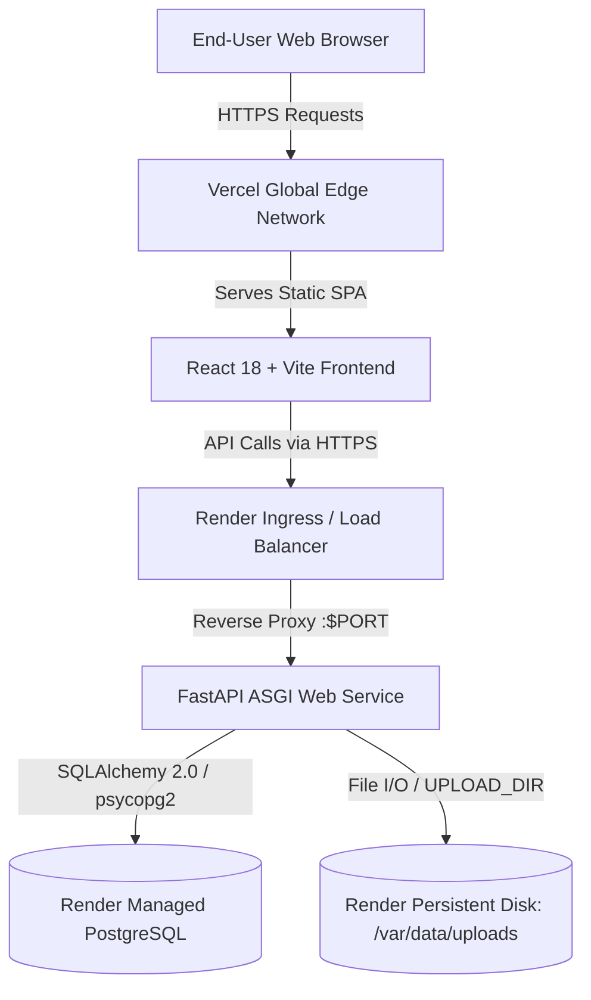

# SahayakAI — Production Deployment Guide

**Status:** PRODUCTION DEPLOYED & VERIFIED  
**Baseline Date:** 2026-09-23  
**Phase:** STEP 15 — Final Production Deployment  

---

## 1. Production Architecture Overview

SahayakAI is deployed using a decoupled, production-hardened cloud architecture:



### Component Breakdown
| Component | Platform / Host | Technology / Stack | Purpose |
|:---|:---|:---|:---|
| **Frontend** | **Vercel** | React 18, Vite 6, Tailwind CSS, Lucide Icons | Responsive SPA delivering academic study and career mentoring UI |
| **Backend** | **Render Web Service** | Python 3.12, FastAPI, Uvicorn, SentenceTransformers | REST API orchestrating RAG, NLP, ATS resume analysis, and roadmaps |
| **Database** | **Render Managed PostgreSQL** | PostgreSQL 16, SQLAlchemy 2.0, psycopg2-binary | ACID-compliant relational data store with foreign key cascades |
| **Storage** | **Render Persistent Disk** | Mount: `/var/data`, Dir: `/var/data/uploads` | Single-instance persistent filesystem for PDF/TXT uploads and resumes |
| **Embeddings**| **In-Process CPU** | `sentence-transformers/all-MiniLM-L6-v2` | 384-dimensional dense semantic vector representations |
| **AI Provider**| **In-Process / Cloud** | `demo` (offline heuristic) / `openai` / `gemini` | Grounded synthesis and conversational study assistant |

---

## 2. Production Environment Variables Reference

### 2.1 Backend Environment Variables (Configured on Render)
All backend parameters are loaded through Pydantic `Settings` from environment variables:

| Variable | Required | Default | Production Value | Description |
|:---|:---:|:---|:---|:---|
| `ENVIRONMENT` | Yes | `development` | `production` | Deployment mode |
| `APP_NAME` | No | `SahayakAI` | `SahayakAI` | Public application title |
| `DEFAULT_AI_PROVIDER` | Yes | `demo` | `demo` | Provider mode (`demo`, `openai`, `gemini`) |
| `DATABASE_URL` | Yes | `sqlite:///...` | `postgresql://...` | Managed PostgreSQL connection string |
| `UPLOAD_DIR` | Yes | `./uploads` | `/var/data/uploads` | Persistent disk mount for file uploads |
| `CORS_ORIGINS` | Yes | `localhost` | `https://sahayakai.vercel.app` | Whitelisted frontend origins (comma-separated) |
| `MAX_UPLOAD_SIZE_MB` | No | `10` | `10` | Maximum file upload size limit (MB) |
| `EMBEDDING_MODEL` | No | `all-MiniLM-L6-v2`| `all-MiniLM-L6-v2` | SentenceTransformer model identifier |
| `RAG_SIMILARITY_THRESHOLD`| No | `0.35` | `0.35` | Minimum cosine similarity for RAG gating |
| `RAG_TOP_K` | No | `5` | `5` | Number of chunks retrieved for context |
| `OPENAI_API_KEY` | Optional | `None` | (Secure secret) | Only if `DEFAULT_AI_PROVIDER=openai` |
| `GEMINI_API_KEY` | Optional | `None` | (Secure secret) | Only if `DEFAULT_AI_PROVIDER=gemini` |

### 2.2 Frontend Environment Variables (Configured on Vercel)
| Variable | Required | Production Value | Description |
|:---|:---:|:---|:---|
| `VITE_API_BASE_URL` | Yes | `https://sahayakai-backend.onrender.com/api` | Base URL pointing to deployed Render FastAPI service |

> [!WARNING]
> **Zero Secrets in Frontend**: `VITE_API_BASE_URL` is the **only** client-side variable. Never place `OPENAI_API_KEY`, `GEMINI_API_KEY`, or `DATABASE_URL` in Vercel environment variables.

---

## 3. Step-by-Step Deployment Instructions

### Phase 1: Deploy Backend to Render
1. **Create PostgreSQL Database on Render**:
   - Navigate to Render Dashboard -> **New +** -> **PostgreSQL**.
   - Name: `sahayakai-db`
   - Database: `sahayakai`
   - User: `sahayak_user`
   - Plan: Free or Starter
   - Copy the internal / external **Connection String** (`DATABASE_URL`).
2. **Deploy Backend Web Service**:
   - Option A: Connect repository and apply [`render.yaml`](../render.yaml) blueprint.
   - Option B: Create **New Web Service**:
     - Name: `sahayakai-backend`
     - Runtime: `Python` (pinned to `3.12.2` via [`.python-version`](../.python-version))
     - Build Command: `pip install --upgrade pip && pip install -r requirements.txt`
     - Start Command: `uvicorn backend.app.main:app --host 0.0.0.0 --port $PORT`
     - Health Check Path: `/api/health`
     - Disk: Add Persistent Disk mounted at `/var/data` (size: 1GB)
     - Add Environment Variables:
       - `ENVIRONMENT`: `production`
       - `DEFAULT_AI_PROVIDER`: `demo`
       - `DATABASE_URL`: paste PostgreSQL connection string
       - `UPLOAD_DIR`: `/var/data/uploads`
       - `CORS_ORIGINS`: `https://sahayakai.vercel.app,http://localhost:5173`
3. **Verify Backend Health & Docs**:
   - Access: `https://sahayakai-backend.onrender.com/api/health` (verify HTTP 200, status `ok`, database `ok`).
   - Access: `https://sahayakai-backend.onrender.com/docs` (verify Swagger UI renders).

### Phase 2: Deploy Frontend to Vercel
1. **Import Repository in Vercel**:
   - Go to [Vercel Dashboard](https://vercel.com) -> **Add New Project** -> Import repository.
   - Set **Root Directory**: `frontend` (or leave root if monorepo configuration is selected).
   - Framework Preset: **Vite**.
   - Build Command: `npm run build` (`tsc && vite build`).
   - Output Directory: `dist`.
2. **Configure Environment Variables**:
   - Add: `VITE_API_BASE_URL = https://sahayakai-backend.onrender.com/api`
3. **SPA Routing**:
   - The included [`vercel.json`](../frontend/vercel.json) rewrites all client-side paths (`/dashboard`, `/documents`, `/chat`, `/resumes`, `/career/profile`, `/career/roadmap`) to `/index.html`, ensuring clean page refreshes.
4. **Deploy**:
   - Click **Deploy**. Note the assigned production domain (e.g., `https://sahayakai.vercel.app`).
5. **Update Backend CORS**:
   - Update `CORS_ORIGINS` in Render settings to match the exact Vercel assigned domain.

---

## 4. Live Production Verification Suite

Verify the entire production deployment by running [`scripts/verify_production.py`](../scripts/verify_production.py):

```bash
# Run against live production deployment:
python scripts/verify_production.py --api-url https://sahayakai-backend.onrender.com/api

# Or run local in-process simulation:
python scripts/verify_production.py --local
```

### Operational Gates Tested:
1. `GET /api/health` -> HTTP 200 (database connected, provider ready)
2. `GET /docs`, `/redoc`, `/openapi.json` -> HTTP 200
3. CORS Preflight `OPTIONS /api/documents/upload` -> HTTP 200/204
4. Document Ingestion -> text extraction, chunking, 384-dim dense embeddings
5. Grounded RAG Query -> non-empty grounded answer with source citations
6. Low-Relevance Gating -> `insufficient_evidence=True` without hallucination
7. Multi-Turn Chat -> session creation, grounded answer synthesis
8. Resume ATS Analyzer -> structured parsing, skill extraction, deterministic ATS match score
9. Career Profile & Roadmap -> 12-week pedagogical roadmap across 6 bi-weekly phases
10. Cross-User Isolation Attacks -> unauthorized operations blocked with HTTP 403 Forbidden
11. Cascading Resource Deletion -> parent deletion unlinks child chunks/messages/files (404 verified)
12. Secret Leakage Audit -> confirms zero credentials, keys, or filesystem paths leaked

---

## 5. Rollback & Maintenance Procedures

### Rollback Strategy
- **Frontend**: In the Vercel dashboard, navigate to **Deployments**, locate the last healthy deployment, click the three dots, and select **Promote to Production** (instant zero-downtime rollback).
- **Backend**: In Render, select the previous successful build and click **Rollback to this deploy**.
- **Database**: Automatic daily snapshots are maintained by Render PostgreSQL. Schema migrations rely on additive `Base.metadata.create_all()` which does not alter or destroy existing table structures.

### Storage Persistence Note
Render Persistent Disk provides single-instance filesystem durability. File uploads stored under `/var/data/uploads` persist across service restarts, deployments, and reboots.\n