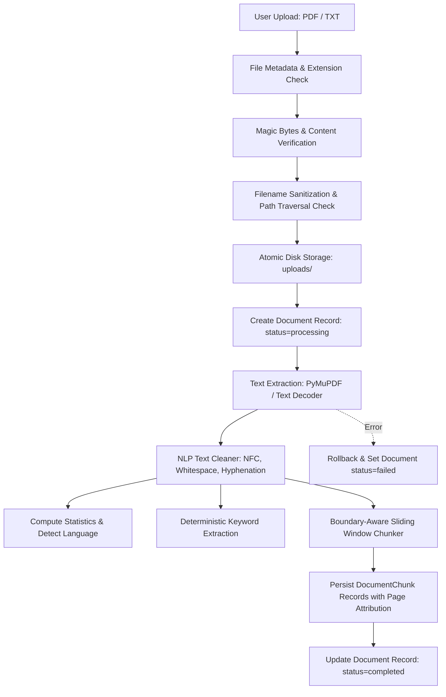

# SahayakAI — Document Processing Architecture Specification

**Status:** ACTIVE  
**Version:** 1.0.0  
**Implemented In:** STEP 5 (Document Processing & Core NLP Pipeline)

---

## 1. Overview & Pipeline Flow

The SahayakAI Document Processing Service manages the secure ingestion, validation, safe filesystem persistence, text extraction, deterministic cleaning, and chunk persistence for user-uploaded academic and career documents.

---

## 2. File Validation Architecture

All uploads undergo strict multi-stage validation in `backend/app/utils/file_validation.py` before any file processing occurs:

1. **Extension Whitelisting**:
   - Only `.pdf` and `.txt` are permitted.
   - Any other extensions (`.docx`, `.exe`, `.csv`, `.py`, etc.) are immediately rejected with HTTP 400 and error code `INVALID_FILE_TYPE`.

2. **Size Enforcement**:
   - Validated both at the HTTP metadata level (`Content-Length` header check) and the byte-stream level (`len(content)`).
   - Maximum upload size is governed by `Settings.MAX_UPLOAD_SIZE_MB` (default `10` MB).
   - Exceeding files return HTTP 413 and error code `FILE_TOO_LARGE`.

3. **Content Integrity & Magic Byte Inspection**:
   - **PDF**: Enforces standard PDF header verification (`%PDF-` bytes in the first 1024 bytes). Missing or invalid headers trigger HTTP 400 `INVALID_FILE_CONTENT`.
   - **TXT**: Examines raw byte content for null bytes (`\x00`) to prevent disguised binary files. Iterates through standard encodings (`utf-8`, `utf-8-sig`, `latin-1`, `windows-1252`, `iso-8859-1`) to decode text cleanly.
   - **Empty Files**: Zero-byte files or files with only whitespace trigger HTTP 400 `EMPTY_FILE`.

---

## 3. Storage Security & Path Traversal Defense

Implemented in `backend/app/utils/filename.py`:

- **Path Traversal Sanitization**:
  - Drops drive letters (`C:`), traversal sequences (`../`, `..\\`), and directory paths via `os.path.basename`.
  - Replaces non-alphanumeric, dangerous shell characters with underscores while preserving Unicode letters (including Devanagari characters).
  - Truncates filenames exceeding 128 characters safely while preserving file extensions.
- **Collision-Free Storage**:
  - Prepends a cryptographic `uuid.uuid4().hex` prefix: `<uuid>_<safe_filename>`.
- **Directory Containment Verification**:
  - `get_safe_storage_path(base_dir, stored_filename)` resolves the canonical absolute path and enforces `target_path.is_relative_to(base_path)`. Traversal attempts raise HTTP 400 `PATH_TRAVERSAL_DETECTED`.

---

## 4. Text Extraction Strategy

- **PDF Documents**:
  - Utilizes **PyMuPDF** (`fitz`), offering native, fast C-level extraction without external system dependencies or Poppler binaries.
  - Page-by-page extraction preserves 1-based page indices: `[(1, page1_text), (2, page2_text), ...]`.
  - Scanned PDFs or PDFs without extractable text are identified and reject processing with `NO_EXTRACTABLE_TEXT`.
- **Plain Text Documents**:
  - Decoded using verified encodings, cleaned, and assigned a virtual page 1.

---

## 5. Transactional Lifecycle & Failure Handling

- Every upload transitions through strict processing states:
  1. `pending`: Initial creation state.
  2. `processing`: Persisted to database before CPU-bound parsing begins.
  3. `completed`: Successfully cleaned, analyzed, chunked, and saved.
  4. `failed`: In case of unexpected parser or database exceptions, transactions are rolled back, and the record is marked `failed` so clients are never stranded in `processing`.

---

## 6. API Endpoints

| Method | Route | Description | Status Code |
|---|---|---|---|
| `POST` | `/api/documents/upload` | Multipart upload of `.pdf` or `.txt` file | `201 Created` |
| `GET` | `/api/documents` | List uploaded documents (paginated) | `200 OK` |
| `GET` | `/api/documents/{id}` | Get document metadata, statistics, keywords | `200 OK` |
| `GET` | `/api/documents/{id}/chunks` | Get ordered text chunks with page attribution | `200 OK` |
| `DELETE` | `/api/documents/{id}` | Delete document and cascade chunks & disk file | `200 OK` |
