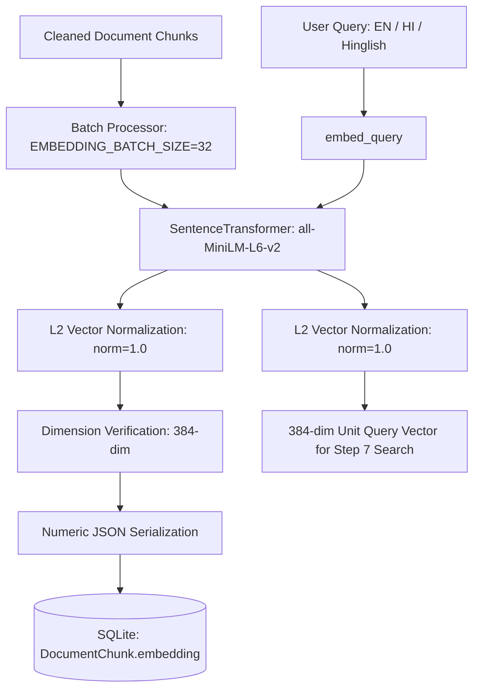

# SahayakAI — Sentence-Embedding & Transformer Pipeline Specification

**Status:** ACTIVE  
**Version:** 1.0.0  
**Implemented In:** STEP 6 (Transformer / Sentence-Embedding Layer)

---

## 1. Overview & Architecture

The SahayakAI Embedding Pipeline provides local, deterministic, offline-capable vector embeddings for document chunks and user queries using the `all-MiniLM-L6-v2` sentence-transformer model. It bridges the text-processing layer (Step 5) with future vector retrieval (Step 7).

---

## 2. Model Selection: `all-MiniLM-L6-v2`

| Attribute | Specification |
|---|---|
| **Model Name** | `sentence-transformers/all-MiniLM-L6-v2` |
| **Output Dimension** | `384` |
| **Parameters** | 22.7 Million |
| **Disk Size** | ~80–90 MB |
| **Memory Footprint** | ~180–250 MB RAM |
| **Max Sequence Length** | 256 / 512 tokens |
| **Architecture** | 6-layer MiniLM transformer backbone with mean-pooling |
| **Default Device** | `cpu` (CUDA supported when available) |

### Why `all-MiniLM-L6-v2` Was Selected
1. **Academic & MCA Project Fit**: Runs comfortably on consumer hardware (standard Windows laptops without dedicated GPUs).
2. **Deterministic & Offline**: Operates completely offline after initial download without external cloud API dependencies, rate limits, or billing.
3. **Inference Latency**: Produces 384-dimensional embeddings in ~10–25 ms per chunk on CPU, which is $5\times$ faster than standard 768-dimensional BERT models.
4. **Strong Retrieval Performance**: Extensively benchmarked on the Massive Text Embedding Benchmark (MTEB) with high semantic search accuracy.

---

## 3. Embedding Generation & Normalization

- **L2 Normalization**:
  - `EMBEDDING_NORMALIZE=True` is applied to all vectors during model inference.
  - Every resulting vector has unit Euclidean norm ($\|\mathbf{v}\|_2 = 1.0$).
  - **Mathematical Advantage**: Cosine similarity between two unit vectors reduces to a simple dot product:
    $$\text{CosineSimilarity}(\mathbf{u}, \mathbf{v}) = \mathbf{u} \cdot \mathbf{v} = \sum_{i=1}^{384} u_i v_i$$
    This eliminates costly square-root calculations during future NumPy similarity searches.
- **Query vs. Chunk Symmetry**:
  - Both queries and document chunks utilize the exact same model, configuration, and normalization rules, ensuring complete mathematical symmetry in vector space.

---

## 4. Vector Validation & Storage

- **Persistence Representation**:
  - Vectors are persisted in the existing `DocumentChunk.embedding` column (SQLAlchemy `JSON` type).
  - Stored as a pure JSON list of standard IEEE 754 floating-point numbers: `[-0.0119, -0.0511, 0.0441, ...]`.
  - **Security Mandate**: Never uses Python `pickle` or arbitrary binary serialization.
- **Validation Constraints**:
  - Dimensionality is strictly verified to match `EMBEDDING_DIMENSION` (384).
  - Checks guarantee finite numbers (rejecting `NaN` and $\pm\infty$).

---

## 5. Model Management & Lifecycle

- **Lazy Loading**: The model is NOT loaded at application import time. It is loaded upon first request or pre-warmed via `scripts/download_embedding_model.py`.
- **In-Process Singleton**: `EmbeddingModelManager` caches the loaded model instance in memory, preventing repeated disk access.
- **Cache Storage**: Model weights reside in the standard Hugging Face hub cache (`~/.cache/huggingface/hub/`) or a configurable `EMBEDDING_CACHE_DIR`.
- **Git Hygiene**: Model weights and caches are explicitly excluded in `.gitignore` and never committed to version control.

---

## 6. Batch Processing & Database Persistence

- The `embed_document_chunks(document_id, db)` service:
  1. Loads all chunks for the document ordered by `chunk_index`.
  2. Batches text inputs according to `EMBEDDING_BATCH_SIZE` (default 32).
  3. Verifies generated dimensions.
  4. Updates `chunk.embedding` on all chunks within a single database transaction.
  5. Rolls back atomically if any error occurs (`EmbeddingPersistenceError`).

---

## 7. Multilingual Support & Limitations

- **Multilingual Behavior**:
  - Supports English, Hindi (Devanagari script), and Hinglish (mixed romanized Hindi).
  - Queries in all three languages generate valid 384-dimensional vectors without tokenizer or runtime crashes.
- **Known Limitations**:
  - `all-MiniLM-L6-v2` is trained predominantly on English datasets with cross-lingual transfer. For production systems targeting deep complex Hindi prose, `paraphrase-multilingual-MiniLM-L12-v2` or `bge-m3` can be configured as a drop-in replacement via `EMBEDDING_MODEL`.
  - Chunk lengths beyond 256–512 wordpieces are truncated. SahayakAI's Step 5 chunker (500 characters $\approx$ 100 words) guarantees all text fits within the model's receptive field.
