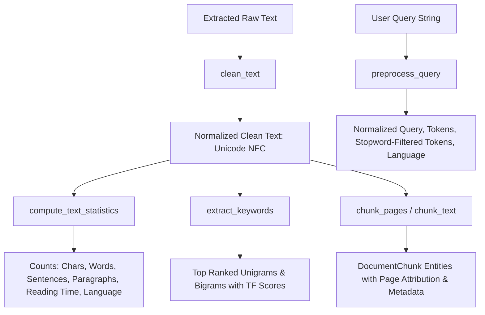

# SahayakAI — Core NLP Pipeline Architecture Specification

**Status:** ACTIVE  
**Version:** 1.0.0  
**Implemented In:** STEP 5 (Document Processing & Core NLP Pipeline)

---

## 1. Overview & Pipeline Structure

The SahayakAI Core NLP Pipeline operates deterministically, providing robust text cleaning, readability metrics, script-based language identification, multilingual keyword extraction, query preprocessing, and boundary-aware document chunking without external network calls or heavy deep-learning model downloads.

---

## 2. Text Cleaner (`backend/app/nlp/text_cleaner.py`)

- **Unicode NFC Normalization**: Unifies composed and decomposed unicode glyphs (`unicodedata.normalize("NFC", text)`), essential for consistent indexing of Devanagari ligatures and accented characters.
- **Control Character Stripping**: Strips null bytes (`\x00`), escape sequences, and binary artifacts while preserving horizontal tabs (`\t`) and line feeds (`\n`).
- **Whitespace Harmonization**: Converts non-standard whitespace (non-breaking space `\u00a0`, thin space, em-space, etc.) to standard ASCII spaces, and eliminates zero-width formatting characters (`\u200b`, `\u200c`, `\u200d`, `\ufeff`).
- **PDF Hyphenation Fix**: Recombines words severed by hyphenation at line breaks (e.g. `"algo-\n  rithm"` $\rightarrow$ `"algorithm"`), both for Latin and Devanagari scripts.
- **Line & Paragraph Normalization**: Strips trailing whitespace on every line and collapses sequences of 3+ consecutive newlines into 2 (clean paragraph breaks).

---

## 3. Document Statistics & Language Detection (`backend/app/nlp/text_statistics.py`)

- **Counts**:
  - `character_count`: Total character length of stripped text.
  - `word_count`: Total token count supporting Latin and Devanagari scripts (`[\w\u0900-\u097F]+`).
  - `sentence_count`: Regex detection on Latin (`.`, `!`, `?`) and Devanagari purna viram (`।` `\u0964`).
  - `paragraph_count`: Count of blocks separated by double linebreaks.
  - `estimated_reading_time_minutes`: Calculated at standard collegiate reading speed (200 words per minute), rounded to 2 decimal places.
- **Language Heuristic**:
  - Computes ratio of Devanagari characters (`[\u0900-\u097F]`) vs. Latin letters.
  - $\text{ratio} \ge 0.35 \implies$ `"hi"` (Hindi).
  - $0.05 \le \text{ratio} < 0.35 \implies$ `"hinglish"` (Mixed script).
  - For predominantly Latin text, inspects common romanized Hinglish marker vocabulary (`hai`, `kya`, `nahi`, `liye`, `bahut`, `samajhna`, `padhai`, etc.). Matching $\ge 2$ markers classifies text as `"hinglish"`; otherwise `"en"` (English).

---

## 4. Multilingual Keyword Extraction (`backend/app/nlp/keyword_extractor.py`)

- **Comprehensive Stopword Filtering**:
  - English: 120+ functional grammatical stopwords.
  - Hindi: Devanagari stopwords (और, कि, का, के, की, है, हैं, था, थी, थे, से, को, पर, में, यह, वह, इस, etc.).
  - Hinglish: Romanized Hindi functional words (hai, hain, tha, thi, the, ka, ke, ki, ko, se, par, me, etc.).
- **N-Gram Synthesis**:
  - Extracts clean unigrams and valid consecutive bigrams.
  - Excludes standalone numerical strings and tokens shorter than 3 characters.
- **Scoring**:
  - Term frequency normalized by $\sqrt{\text{total tokens}}$.
  - Bigrams receive a $1.3\times$ boost to prioritize specific keyphrases (e.g., `"machine learning"`, `"neural network"`).
  - Returns structured `[{"keyword": str, "score": float, "count": int}, ...]`.

---

## 5. Query Preprocessing (`backend/app/nlp/query_preprocessor.py`)

Prepares incoming conversational and search queries for future local RAG retrieval:
- Preserves raw `original_query`.
- Computes lowercased, punctuation-stripped `normalized_query`.
- Extracts all tokens.
- Extracts `filtered_tokens` with multilingual stopwords removed.
- Identifies query language (`en`, `hi`, `hinglish`).

---

## 6. Boundary-Aware Document Chunker (`backend/app/nlp/chunker.py`)

- **Target Size & Overlap**:
  - Configurable via `Settings.CHUNK_SIZE` (default 500 characters) and `Settings.CHUNK_OVERLAP` (default 50 characters).
- **Natural Boundary Detection**:
  - Inspects the trailing 25% of the chunk window for:
    1. Paragraph boundaries (`\n\n`)
    2. Sentence boundaries (`. `, `! `, `? `, `। `)
    3. Word boundaries (` `)
  - Prevents mid-word and mid-sentence splits.
- **Page Attribution (`chunk_pages`)**:
  - Maps text segments to 1-based page numbers from PDF extraction.
  - Populates `DocumentChunk.chunk_metadata` with `page_number`, `start_char`, and `end_char` for precise source citation during downstream RAG QA.
