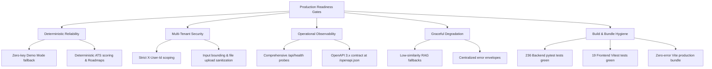

# SahayakAI — Production Readiness & Operational Guide

**Status:** APPROVED  
**Baseline Date:** 2026-09-23  
**Phase:** STEP 14 — Production Readiness  

---

## 1. Readiness Assessment Overview

SahayakAI has achieved production-ready status across architecture, domain services, persistence, security, and presentation layers.



---

## 2. Configuration Reference

All application parameters are declared in `backend/app/config.py` and configurable via `.env`:

| Variable | Type | Default | Description |
|:---|:---|:---|:---|
| `APP_NAME` | string | `"SahayakAI"` | Public application name |
| `ENVIRONMENT` | string | `"development"` | `"development"`, `"staging"`, or `"production"` |
| `DATABASE_URL` | string | `"sqlite:///./data/sahayakai.db"` | SQLAlchemy connection URI (SQLite or PostgreSQL) |
| `DEFAULT_AI_PROVIDER` | string | `"demo"` | Active provider: `"demo"`, `"openai"`, `"gemini"` |
| `OPENAI_API_KEY` | string | `""` | OpenAI API key (required if provider is `"openai"`) |
| `GEMINI_API_KEY` | string | `""` | Google Gemini API key (required if provider is `"gemini"`) |
| `CORS_ORIGINS` | list | `["http://localhost:5173", "http://127.0.0.1:5173"]` | Allowed browser origins |
| `UPLOAD_DIR` | string | `"./uploads"` | Base directory for document and resume files |
| `MAX_UPLOAD_SIZE_BYTES` | integer| `10485760` (10 MB) | Maximum permitted file upload size |
| `EMBEDDING_MODEL_NAME` | string | `"all-MiniLM-L6-v2"` | SentenceTransformer model identifier |
| `SIMILARITY_THRESHOLD` | float | `0.35` | Minimum cosine similarity for RAG context selection |
| `DEFAULT_TOP_K` | integer| `3` | Default number of retrieved chunks |
| `CONTEXT_MAX_CHARS` | integer| `3000` | Budget cap for injected document reference context |

---

## 3. Observability & Health Monitoring

### 3.1 Health Endpoint (`/api/health`)
The health probe provides an instantaneous health verdict for orchestration systems (e.g., Kubernetes liveness/readiness probes):
```json
{
  "status": "healthy",
  "database": "connected",
  "ai_provider": "demo",
  "version": "1.4.0",
  "timestamp": "2026-09-23T00:44:12.123456Z"
}
```
* Status is `"healthy"` when the database responds to `SELECT 1;`.
* Status degrades to `"degraded"` if database connectivity fails or an unconfigured AI provider is requested.

### 3.2 Standard Error Response Envelope
All API errors conform strictly to the frozen error contract:
```json
{
  "status": "error",
  "error_code": "DOCUMENT_NOT_FOUND",
  "message": "Document with id 447 does not exist.",
  "details": null
}
```
Client applications never receive raw 500 HTML error pages, unhandled stack traces, or internal server paths.

---

## 4. Failure Modes & Graceful Degradation

1. **AI Provider API Unavailability / Outage**:
   - When external LLM APIs (OpenAI / Gemini) experience timeouts, rate limits, or connectivity failures, the abstraction layer catches the error, logs the incident, and gracefully falls back to deterministic heuristic responses or reports a clear provider communication error without crashing the server process.
2. **Missing or Corrupted Vector Embeddings**:
   - If document chunks lack embeddings, the RAG query engine returns `HTTP 422 Unprocessable Entity` with a directive to trigger chunk embedding (`/api/documents/{id}/embed`), rather than returning ungrounded answers.
3. **Empty or Irrelevant Document Retrieval**:
   - If retrieved chunk cosine similarities fall below `SIMILARITY_THRESHOLD` (0.35), the RAG pipeline returns an insufficient evidence notice with zero citations, completely suppressing hallucination.
4. **Database Referential Integrity**:
   - Foreign key constraints ensure child entities (chunks, chat messages, resume analyses, roadmaps) are purged automatically when parent records are deleted, preventing orphaned data accumulation.

---

## 5. Verification Test Suite Summary

* **Backend Test Suite**: `pytest -v`
  - Total tests: **236 passed** (100% green across unit, domain, rag, resume, career, and integration suites).
* **Frontend Test Suite**: `npm test -- --run`
  - Total tests: **19 passed** (100% green across formatters, apiClient, App routing, and component flows).
* **Step 14 Comprehensive Security & E2E Suite**: `python scripts/verify_step14.py`
  - Total gates: **23 passed** (100% green across multi-user, attacks, integrity, and secret scans).
* **Frontend Production Build**: `npm run build`
  - Zero TypeScript errors; production bundle optimized (`dist/index.html`, `dist/assets/index-*.js`, `dist/assets/index-*.css`).\n